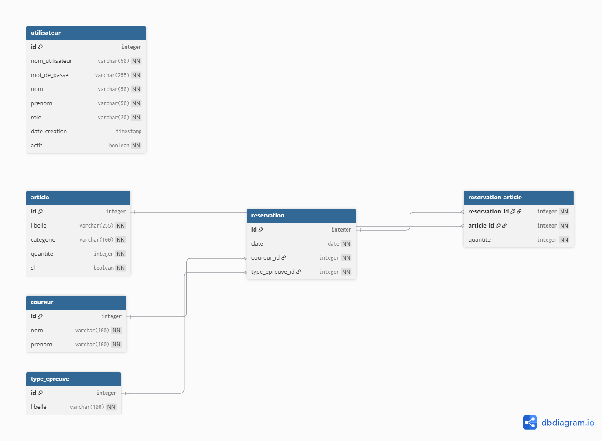

# JavaStock

Système de gestion de stock pour épreuves sportives (Java Swing + PostgreSQL).

## Description

JavaStock est une application desktop complète permettant de gérer les stocks d'articles, les coureurs, les types d'épreuve et les réservations pour des événements sportifs. L'application dispose d'une interface graphique moderne avec thème sombre, un système d'alertes de stock en temps réel, et un historique complet des opérations base de données.

## Fonctionnalités

- **📦 Articles** — CRUD complet, tableau trié avec indicateurs de stock (OK / Stock bas / Rupture)
- **🏃 Coureurs** — Gestion des coureurs participants
- **🏆 Types d'épreuve** — Gestion des catégories d'épreuves sportives
- **📋 Réservations** — Création avec association d'articles et vue détaillée
- **⚠️ Alertes** — Dashboard des ruptures de stock avec réapprovisionnement direct
- **📈 Historique** — Visualisation en temps réel des logs BDD avec filtrage et auto-refresh

## Structure du projet

```
javastock/
├── src/JavaStocks/              # Code source Java
│   ├── MainMenu.java            # Dashboard principal (point d'entrée)
│   ├── DatabaseConnection.java  # Connexion PostgreSQL
│   ├── DbLogger.java            # Logger centralisé BDD (console + mémoire)
│   ├── ArticleMenu.java         # Interface articles (onglets liste/création)
│   ├── CoureurMenu.java         # Interface coureurs
│   ├── TypeEpreuveMenu.java     # Interface types d'épreuve
│   ├── ReservationMenu.java     # Interface réservations
│   ├── AlerteMenu.java          # Dashboard alertes et réapprovisionnement
│   ├── HistoriqueMenu.java      # Visualiseur de logs BDD temps réel
│   ├── Article.java             # Modèle Article
│   ├── ArticleDAO.java          # DAO Article
│   ├── Coureur.java             # Modèle Coureur
│   ├── CoureurDAO.java          # DAO Coureur
│   ├── TypeEpreuve.java         # Modèle TypeEpreuve
│   ├── TypeEpreuveDAO.java      # DAO TypeEpreuve
│   ├── Reservation.java         # Modèle Reservation
│   ├── ReservationDAO.java      # DAO Reservation
│   ├── ReservationArticle.java  # Modèle ReservationArticle
│   ├── Boisson.java             # Sous-type Article
│   ├── Textile.java             # Sous-type Article
│   └── DenreeSeche.java         # Sous-type Article
├── bin/JavaStocks/              # Fichiers compilés
├── lib/                         # Bibliothèques
│   └── postgresql-42.7.1.jar
├── db/                          # Scripts SQL
│   └── schema.sql
├── database.sql                 # Schéma de création BDD
├── reset_and_import.sql         # Reset + import de données
├── import_data.sql              # Données de test
├── docker-compose.yml           # PostgreSQL + pgAdmin via Docker
├── run.bat                      # Lancer l'application
├── stop.bat                     # Arrêter les processus orphelins
├── test_db.bat                  # Tester la connexion BDD
├── check_counts.bat             # Vérifier les comptages en BDD
├── ouvrir_pgadmin.bat           # Ouvrir pgAdmin dans le navigateur
└── pom.xml                      # Configuration Maven
```


## Installation

### Prérequis

- **Java JDK 21** ou supérieur (testé avec Temurin 25)
- **Docker** et **Docker Compose** (pour PostgreSQL + pgAdmin)
- Ou bien PostgreSQL 15+ installé localement

### Avec Docker (recommandé)

1. **Cloner le projet**

```bash
git clone https://github.com/maxlo245/javastock.git
cd javastock
```

2. **Lancer PostgreSQL + pgAdmin**

```bash
docker-compose up -d
```

Cela démarre :
- PostgreSQL sur le port `5432` (user: `admin`, password: `root`, base: `javastocks`)
- pgAdmin sur le port `8080` (email: `admin@admin.com`, password: `root`)

3. **Initialiser la base de données**

Se connecter à la BDD via pgAdmin (`ouvrir_pgadmin.bat`) ou psql, puis exécuter :

```sql
-- Créer le schéma et importer les données de test
\i reset_and_import.sql
```

4. **Compiler le projet**

```bash
javac -encoding UTF-8 -sourcepath src -cp "lib/postgresql-42.7.1.jar" -d "bin/JavaStocks" src/JavaStocks/MainMenu.java
```

5. **Lancer l'application**

```bash
run.bat
```

## Utilisation

### Dashboard principal

Le menu principal affiche 6 boutons colorés donnant accès aux différentes fonctionnalités. La barre de statut en bas indique l'état de la connexion BDD.

### Gestion des articles

- Onglet **Liste** : tableau triable avec statut de stock (✅ OK / ⚠ Stock bas / ⚠ Rupture)
- Onglet **Créer** : formulaire avec libellé, catégorie (Textile/Boisson/DenreeSeche) et quantité
- Suppression logique (l'article n'est pas effacé de la BDD)

### Alertes de stock

- **Compteurs** en haut : nombre de ruptures, stock bas, OK et total
- **Réapprovisionnement** : sélectionner un article → cliquer "Réapprovisionner" → entrer la quantité à ajouter
- **Filtre** : afficher uniquement les ruptures ou tous les articles

### Historique des opérations

- **Log en temps réel** de toutes les requêtes SQL exécutées
- **Filtrage** par niveau (SQL/OK/ERROR/CONN/INFO) et par recherche textuelle
- **Auto-refresh** toutes les 3 secondes
- Les lignes d'erreur sont affichées en rouge

### Raccourcis clavier

| Raccourci | Action |
|-----------|--------|
| `Ctrl+Q`  | Quitter l'application |
| `Escape`  | Fermer la fenêtre courante |

## Scripts utilitaires

| Script | Description |
|--------|-------------|
| `run.bat` | Compile et lance l'application |
| `stop.bat` | Tue les processus Java orphelins |
| `test_db.bat` | Teste la connexion et les opérations CRUD |
| `check_counts.bat` | Affiche le nombre d'enregistrements par table |
| `ouvrir_pgadmin.bat` | Ouvre pgAdmin dans le navigateur |

## Technologies utilisées

- **Java 21+** — Langage de programmation (compatible JDK 25)
- **Swing + Nimbus** — Interface graphique avec thème moderne
- **PostgreSQL 15** — Base de données relationnelle
- **JDBC** — Connexion base de données (driver PostgreSQL 42.7.1)
- **Docker Compose** — Conteneurisation BDD + pgAdmin
- **Maven** — Gestion des dépendances (optionnel)

## Architecture

L'application suit une architecture en couches :

1. **Couche Présentation** (`*Menu.java`) — Interfaces Swing avec onglets, tableaux triables, formulaires
2. **Couche Métier** (`*.java` modèles) — Objets métier (Article, Coureur, TypeEpreuve, Reservation)
3. **Couche DAO** (`*DAO.java`) — Accès aux données avec logging intégré
4. **Couche Infrastructure** — `DatabaseConnection` (singleton JDBC) + `DbLogger` (logs centralisés)
5. **Base de données** — PostgreSQL avec contraintes CHECK, clés étrangères, suppression logique

### Schéma de la base de données (MCD)



## Fonctionnalités à venir

- Export des données en PDF/Excel
- Statistiques et graphiques
- Gestion multi-utilisateurs

## Auteur

**Maxime LAURENT**

## Licence

MIT License

## Contribution

Les contributions sont les bienvenues ! N'hésitez pas à ouvrir une issue ou une pull request.

## Support

Pour toute question ou problème, veuillez ouvrir une issue sur le dépôt GitHub.

---

**Date de dernière mise à jour** : 13/02/2026
**Version** : 2.0.0
